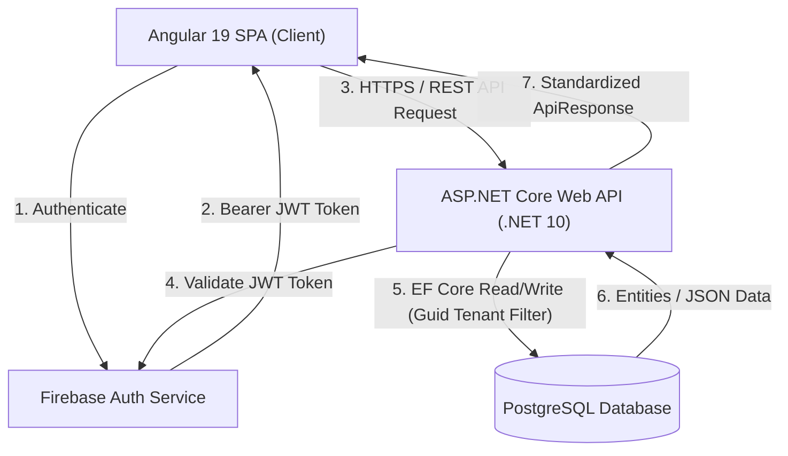

# Momentum - System Architecture & Design Topology

This document outlines the architectural patterns, structural design, and data flow principles governing the **Momentum** ecosystem.

---

## 1. End-to-End System Topology

Momentum follows a modern Client-Server decoupled architecture:



---

## 2. Backend Architecture: Clean Architecture

The backend solution (`Lifenote.sln`) is organized into four concentric layers following strict **Clean Architecture** principles. Dependencies strictly flow **inward** toward the Domain core.

```
Lifenote.API (Presentation Layer)
  └── Lifenote.Infrastructure (External Services & Persistence)
        └── Lifenote.Application (Use Cases & Business Logic Contracts)
              └── Lifenote.Domain (Core Enterprise Logic & Entities)
```

### Layer Breakdown & Design Rules

#### 1. Domain Layer (`Lifenote.Domain`)
- **Responsibility:** Contains enterprise business rules, domain entities (`Goal`, `Note`, `FocusSession`, `UserInfo`), enums, and domain exception definitions.
- **Strict Rule:** Must have **ZERO external dependencies**. No EF Core, no ASP.NET Core, no third-party libraries.
- **Base Types:** Entities inherit from `BaseEntity<Guid>` or `AggregateRoot<Guid>`.

#### 2. Application Layer (`Lifenote.Application`)
- **Responsibility:** Contains application logic, use case implementations, service interfaces (`Contracts`), and Data Transfer Objects (DTOs).
- **Strict Rule:** Can reference `Domain`, but must know nothing about database drivers, SQL, or API controllers.
- **Pattern:** Interfaces (e.g., `INoteService`, `IGoalsService`) define operational contracts. Implementations execute logic, map entities to DTOs, and enforce application rules.

#### 3. Infrastructure Layer (`Lifenote.Infrastructure`)
- **Responsibility:** Encapsulates external concerns such as EF Core DbContext (`LifenoteDbContext`), database migrations, repository implementations, and Firebase Admin SDK authentication services.
- **Strict Rule:** Third-party SDKs and database query builders belong exclusively in this layer.

#### 4. API / Presentation Layer (`Lifenote.API`)
- **Responsibility:** Thin HTTP controllers, global exception handling middleware (`ExceptionHandlingMiddleware`), model binding, and request/response mapping extensions.
- **Strict Rule:** Controllers must remain ultra-thin. They parse user identity (`GetUserIdAsync()`), delegate work to Application services, and wrap responses in `ApiResponse<T>`.

---

## 3. Frontend Architecture: Feature-Oriented Angular

The Angular client strictly adopts a modular **Feature-Based Architecture** under `src/app/`.

```
src/app/
├── core/         # Singleton services (Auth, Theme, Toast, Layout), guards, interceptors
├── shared/       # Reusable UI components (Cards, Search, Header), pipes, directives
├── layout/       # App shell framework (Sidebar, Topbar, Main Viewport)
└── features/     # Isolated feature modules
    ├── auth/     # Login, Register, Auth Guards
    ├── goals/    # Goals overview, Milestone manager
    ├── home/     # Dashboard widgets & summary metrics
    ├── notes/    # Note editor, list view, categorization
    ├── pomodoro/ # Live Timer, Session telemetry dashboard
    └── settings/ # User preferences, theme settings, profile controls
```

### Component Guidelines
- **Dumb / Presentation Components (`/components`):** Accept data via `input()` signals, trigger changes via `output()` emitters, and contain minimal logic.
- **Smart / Page Components (`/pages`):** Handle route parameters, inject feature services, manage signal state, and coordinate UI presentation components.

---

## 4. Cross-Cutting Architectural Patterns

### Tenant Isolation
Every database entity includes a `UserId` field (`Guid`). Services in `Lifenote.Application` append `.Where(x => x.UserId == userId)` to every query to guarantee multi-tenant data separation.

### Unified API Response Contract
All endpoints in `Lifenote.API` standardize their responses via `ApiResponse<T>`:
```csharp
public class ApiResponse<T>
{
    public bool Success { get; set; }
    public string Message { get; set; }
    public T Data { get; set; }
    public List<string> Errors { get; set; }
}
```

### Global Error Pipeline
Controllers do not use inline `try/catch` blocks. The custom `ExceptionHandlingMiddleware` intercepts all uncaught exceptions, maps domain/application errors to appropriate HTTP status codes (400, 404, 401, 500), and outputs a uniform `ApiResponse<T>`.

---

## 5. Summary Navigation

- [Product Overview](file:///d:/Lifenote/docs/core/00_overview.md)
- [Backend Technical Deep Dive](file:///d:/Lifenote/docs/core/02_backend.md)
- [Frontend Technical Deep Dive](file:///d:/Lifenote/docs/core/03_frontend.md)
- [Data Models & Schema](file:///d:/Lifenote/docs/core/04_data_models_and_schema.md)
- [Authentication & Security](file:///d:/Lifenote/docs/core/05_auth_and_security.md)
- [AI & Developer Guidelines](file:///d:/Lifenote/docs/core/06_ai_and_developer_guidelines.md)
